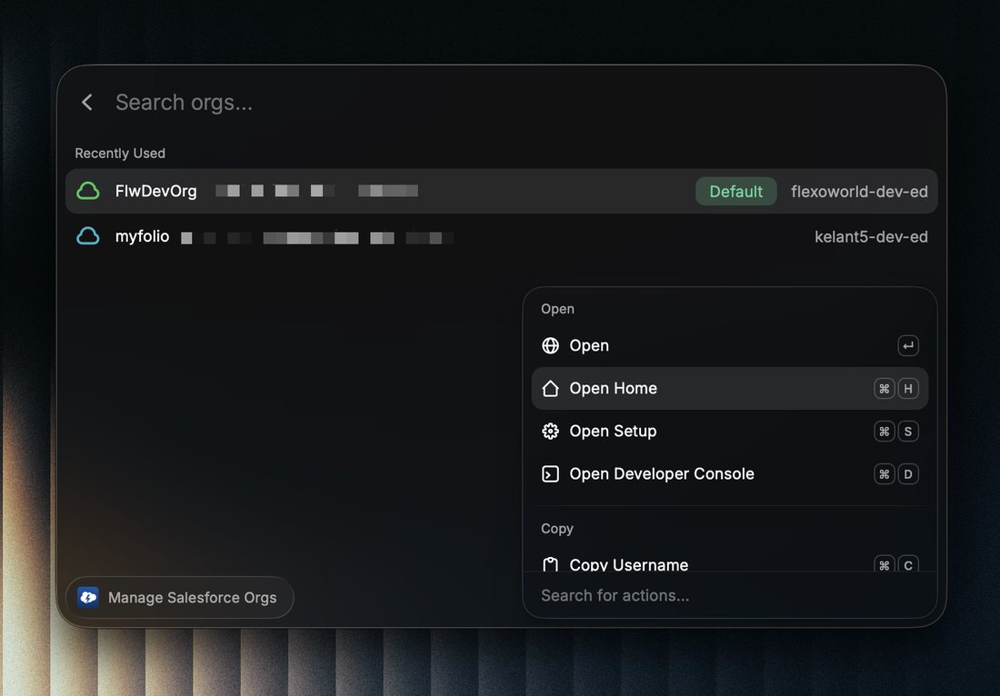
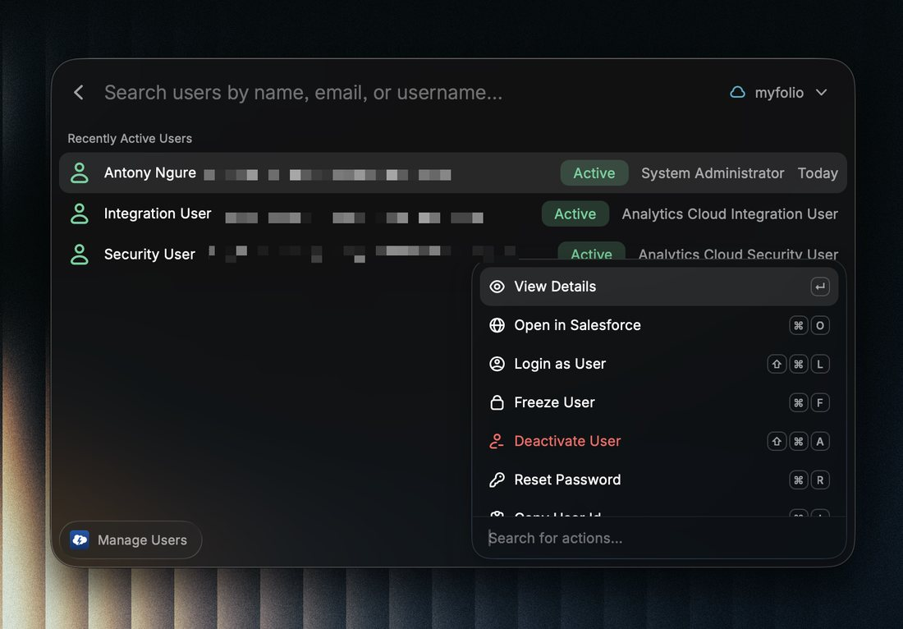
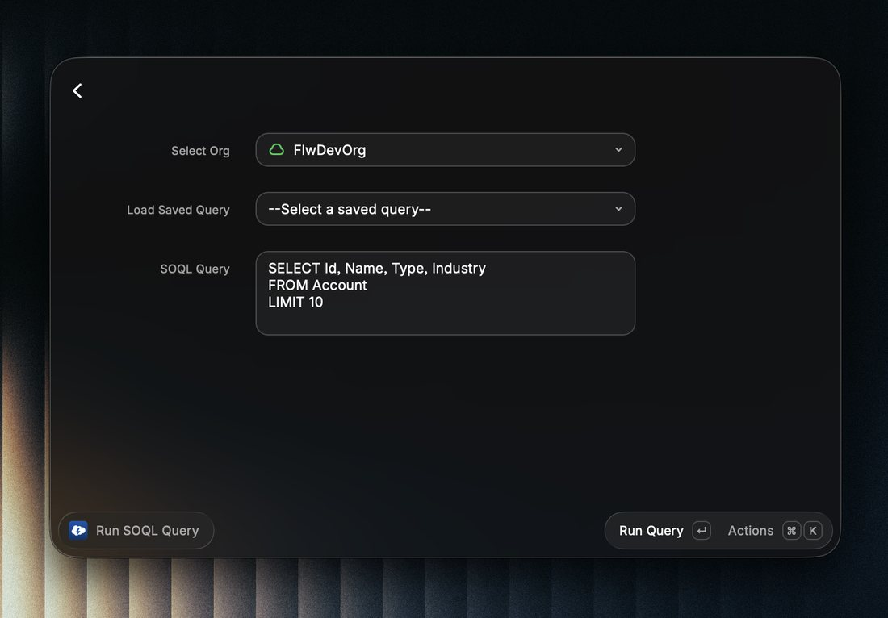
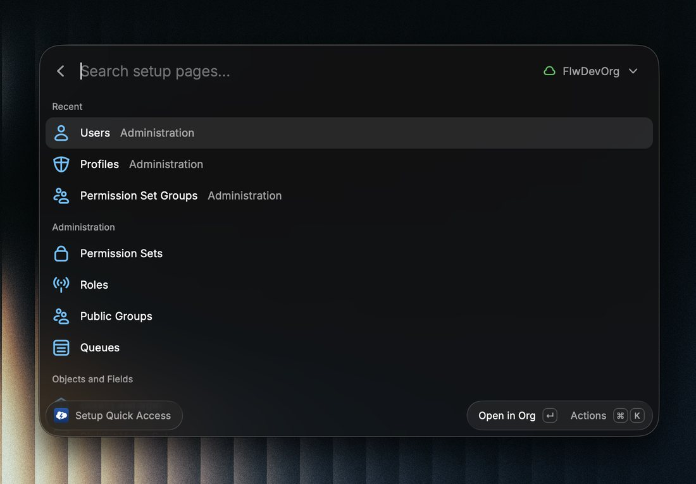
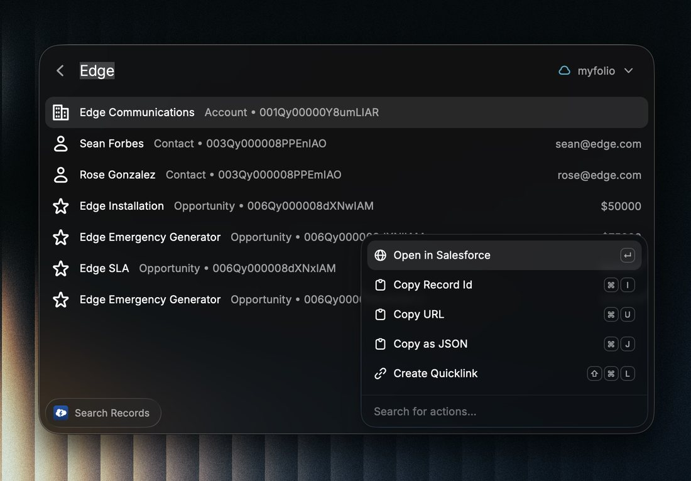
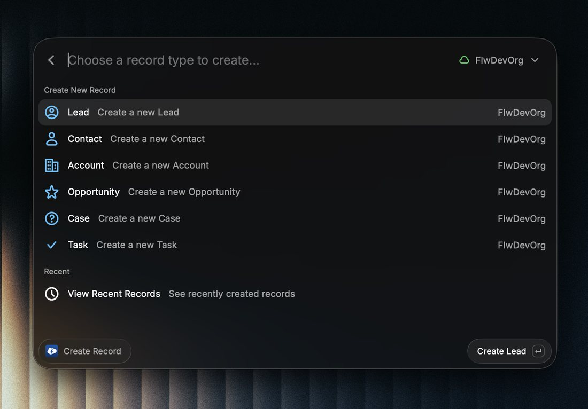

# QuickForce

Keyboard-driven Salesforce toolkit for developers and admins. Seven commands covering the most common org management, data access, and admin tasks, all without opening a browser.


## Screenshots

| Org management | Manage users |
| --- | --- |
|  |  |

| SOQL query | Setup quick access |
| --- | --- |
|  |  |

| Search records | Create records |
| --- | --- |
|  |  |


## Requirements

- [Raycast](https://raycast.com/)
- [Salesforce CLI](https://developer.salesforce.com/tools/salesforcecli) installed and authenticated with at least one org

Verify your setup before installing:

```bash
sf org list auth
```

If that returns your orgs, you're ready.

To authenticate a new Salesforce org, run:

```bash
sf org login web
```

QuickForce reads the orgs already authenticated through the Salesforce CLI. It does not ask for or store Salesforce passwords.

---

## Commands

### Manage Salesforce Orgs

Lists all your authenticated orgs. Recently used orgs sort to the top automatically. Customize each org with a label, color, and section to keep things organized across multiple clients or environments.

| Action                 | Shortcut |
| ---------------------- | -------- |
| Open org               | `↵`      |
| Open Setup             | `⌘ S`    |
| Open Developer Console | `⌘ D`    |
| Open Lightning Home    | `⌘ H`    |
| Copy username          | `⌘ C`    |
| Copy Org ID            | `⌘ ⇧ C`  |
| Copy instance URL      | `⌥ C`    |
| Set as default org     | `⌘ ⇧ D`  |
| Logout                 | `⌃ X`    |

Scratch org expiration dates are shown automatically when detected.

---

### Org Details

Pulls org limits, current user info, and installed packages for any org. Each section loads independently, so a failed API call in one area does not block the rest.

- API limits with color-coded usage (green below 70%, orange 70-89%, red 90%+)
- Org edition and type (Production, Sandbox, Scratch)
- Current user profile and role
- All installed managed and unmanaged packages

---

### Run SOQL Query

Run any SOQL query against a selected org. Every query is saved to history automatically.

- History stores the last 50 queries
- Star queries as favorites for fast reuse
- Label saved queries so they are easy to find later
- Copy results as JSON or copy individual record IDs

| Action              | Shortcut |
| ------------------- | -------- |
| Copy result as JSON | `⌘ C`    |
| Copy record ID      | `⌘ I`    |
| Save to favorites   | `⌘ S`    |
| View query history  | `⌘ H`    |

---

### Search Records

Global search across Accounts, Contacts, Opportunities, Leads, and Cases. Type at least two characters and select a result to open the record directly in Salesforce.

---

### Manage Users

Search users by name, email, or username. View login history and run admin actions directly.

- Last 20 login attempts with IP, browser, and platform
- Reset password (forces reset on next login)
- Freeze or unfreeze login access
- Activate or deactivate user records

| Action                         | Shortcut |
| ------------------------------ | -------- |
| View details and login history | `↵`      |
| Freeze / Unfreeze              | `⌘ F`    |
| Activate / Deactivate          | `⌘ ⇧ A`  |
| Reset password                 | `⌘ R`    |
| Copy user ID                   | `⌘ I`    |
| Copy username                  | `⌘ U`    |
| Copy email                     | `⌘ E`    |

---

### Setup Quick Links

Jump to any Salesforce Setup page without clicking through menus. Over 40 pages pre-configured across eight categories.

**Categories:** Administration, Objects and Fields, Automation, Security, Development, Integrations, Data Management, Company Settings

- Search by page name or keyword
- Pin pages you access often
- Last 10 visited pages tracked automatically

| Action             | Shortcut |
| ------------------ | -------- |
| Open in Salesforce | `↵`      |
| Pin / Unpin        | `⌘ P`    |
| Copy path          | `⌘ C`    |

---

### Create Record

Create common Salesforce records without opening a browser. Supports Lead, Contact, Account, Opportunity, Case, and Task. Required fields are validated before submission, and the last 20 created records are tracked for quick reference.

---

## Troubleshooting

**No orgs found**

Run `sf org list auth` in your terminal. If your orgs appear there but not in QuickForce, restart Raycast with `⌘ Q` and reopen.

**Auth error when opening an org**

The session token may have expired. Run `sf org display --target-org <username>` to check, then log out and back in using the Logout action in Manage Orgs.

**SOQL query returns fewer records than expected**

QuickForce fetches results directly from the Salesforce API, which returns up to ~2,000 records per batch. Add a `LIMIT` clause to scope large queries, or narrow the `WHERE` filter.

**Search returns no results**

Search requires at least two characters and only works on SOSL-indexed fields. If a custom object or field is not returning results, check whether the field is indexed in Salesforce Setup.

---

## Contributing

Bug reports, feature requests, and pull requests are welcome. Run `npm run fix-lint` before submitting a PR.

## License

MIT
